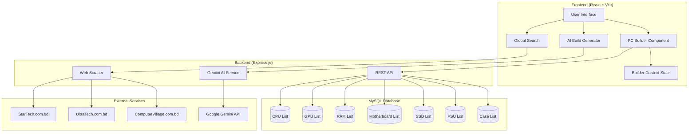

# 🖥️ AI-Powered PC Builder

## Project Report

**Project Name:** AI-Powered PC Builder  
**Version:** 1.0.0  
**Author:** Rehanul Bary  
**Technologies:** React.js, Express.js, MySQL, Google Gemini AI

---

## 📋 Table of Contents

1. [Project Overview](#project-overview)
2. [Technology Stack](#technology-stack)
3. [System Architecture](#system-architecture)
4. [Database Design](#database-design)
5. [Key Features](#key-features)
6. [Evaluation Progress](#evaluation-progress)
7. [Implementation Details](#implementation-details)
8. [Future Enhancements](#future-enhancements)

---

## 🎯 Project Overview

The **AI-Powered PC Builder** is a comprehensive web application designed to help users in Bangladesh build custom PCs. The application combines intelligent AI recommendations, real-time price comparison through web scraping, and a sophisticated compatibility checking system to ensure users can assemble a working PC configuration.

### Key Objectives

- ✅ Enable users to build custom PC configurations with compatible components
- ✅ Provide AI-powered build recommendations based on budget and use case
- ✅ Compare prices across multiple Bangladeshi e-commerce platforms
- ✅ Ensure component compatibility with real-time validation
- ✅ Maintain an up-to-date database of latest PC components

---

## 🛠️ Technology Stack

### Frontend
| Technology | Version | Purpose |
|------------|---------|---------|
| React.js | 19.1.1 | UI Framework |
| Vite | 7.1.2 | Build Tool |
| Tailwind CSS | 4.1.17 | Styling |
| React Router DOM | 7.8.2 | Navigation |
| Axios | 1.13.1 | HTTP Client |
| Lucide React & Heroicons | Latest | Icons |
| html2canvas | 1.4.1 | Screenshot Feature |

### Backend
| Technology | Version | Purpose |
|------------|---------|---------|
| Express.js | 5.1.0 | Web Server |
| MySQL2 | 3.15.3 | Database Driver |
| Cheerio | 1.1.2 | HTML Parser (Scraping) |
| Axios | 1.13.1 | HTTP Requests |
| @google/generative-ai | 0.24.1 | Gemini AI Integration |
| CORS | 2.8.5 | Cross-Origin Support |
| dotenv | 17.2.3 | Environment Config |

---

## 🏗️ System Architecture



---

## 🗄️ Database Design

The application uses a **MySQL** database with 7 component tables containing **150+ latest products** with up-to-date specifications and pricing in BDT.

### Tables Overview

| Table | Records | Description |
|-------|---------|-------------|
| `cpulist` | 30 | Processors (Intel Core Ultra, AMD Ryzen 9000 series) |
| `gpulist` | 30 | Graphics Cards (RTX 4090, RX 7900 series) |
| `ramlist` | 30 | Memory (DDR4/DDR5 up to 128GB) |
| `mobolist` | 19 | Motherboards (AM4, AM5, LGA1700, LGA1851) |
| `ssdlist` | 30 | Storage (PCIe 5.0 NVMe SSDs) |
| `psulist` | 30 | Power Supplies (450W - 1600W) |
| `caselist` | 15 | Cases (Mini Tower to Full Tower) |

### Schema Highlights

#### CPU Table
```sql
CREATE TABLE cpulist (
  productid VARCHAR(6) PRIMARY KEY,
  brand VARCHAR(5),          -- Intel/AMD
  name VARCHAR(50),
  price INT,
  socket VARCHAR(7),         -- AM4, AM5, LGA1700, LGA1851
  clockspeed VARCHAR(23),
  cache VARCHAR(47),
  cores INT,
  threads INT,
  igpu VARCHAR(3)            -- Yes/No
);
```

#### Motherboard Table
```sql
CREATE TABLE mobolist (
  productid VARCHAR(5) PRIMARY KEY,
  brand VARCHAR(8),
  name VARCHAR(59),
  price VARCHAR(5),
  socket VARCHAR(7),
  formfactor VARCHAR(9),     -- ATX, Micro-ATX
  ramtype VARCHAR(4),        -- DDR4/DDR5
  ramslot VARCHAR(2),
  pcie VARCHAR(1),           -- PCIe generation
  supportedcpu VARCHAR(65)
);
```

### Compatibility Mapping

```javascript
const socketDdrCompatibility = {
  AM4: ["DDR4"],
  AM5: ["DDR5"],
  LGA1700: ["DDR4", "DDR5"],
  LGA1851: ["DDR5"]
};
```

---

## ⭐ Key Features

### 1. PC Builder with Compatibility Checking

The core feature allowing users to build PCs component by component with real-time compatibility validation.

**Features:**
- 🔄 Clear buttons to remove individual components
- 🔀 Choose/Change buttons that work correctly based on selection state
- ⚠️ Detailed incompatibility messages explaining why components don't work together
- 💰 Real-time total price calculation in BDT

**Compatibility Checks:**
- CPU ↔ Motherboard socket matching
- Motherboard ↔ RAM type (DDR4/DDR5) validation
- Form factor and GPU clearance verification

### 2. AI-Powered Build Generator

Leverages **Google Gemini AI** to generate custom PC builds based on user requirements.

**Input Options:**
| Purpose | Description |
|---------|-------------|
| Gaming | Optimized for FPS and graphics |
| Video Editing | Balanced CPU/GPU performance |
| Programming | CPU-focused with adequate RAM |
| 3D Rendering | Maximum processing power |

**Sample AI Prompt:**
```
Build a PC for gaming with a budget of 85000 BDT.
```

### 3. Real-Time Price Comparison

Web scraping feature that searches products across 3 major Bangladeshi e-commerce platforms.

**Supported Sites:**
| Store | Color Badge | Technology |
|-------|-------------|------------|
| StarTech | 🔴 #ef4444 | Axios + Cheerio |
| UltraTech | 🔵 #3b82f6 | Axios + Cheerio |
| Computer Village | 🟢 #10b981 | Axios + Cheerio |

**Features:**
- Top 30 results sorted by price (lowest first)
- Product images and direct links
- Price statistics (lowest/highest)
- Error handling for failed scrapes

### 4. Component Filtering & Sorting

Each component page features advanced filtering options:

**CPU Filters:**
- Cores: 4, 6, 8, 12, 16
- Brands: Intel, AMD
- Sockets: AM4, AM5, LGA1700, LGA1851
- Price Ranges: ৳10K-20K, ৳20K-40K, ৳40K-60K, ৳60K-100K

**Sorting Options:**
- Price: Low to High
- Price: High to Low
- Default Order

---

## 📊 Evaluation Progress

### Evaluation 1 - Initial Feedback & Implementation

| Feedback | Action Taken | Status |
|----------|--------------|--------|
| UI Rephrase | Redesigned entire UI with modern aesthetics | ✅ Complete |
| Database Design | Created 7 normalized tables with proper relationships | ✅ Complete |
| Latest Information | Added latest components (Intel Core Ultra, Ryzen 9000, DDR5) | ✅ Complete |
| User-Friendly Design | Implemented intuitive navigation and filtering | ✅ Complete |

**Technical Implementation:**
- Web scraping implemented using **Axios** for HTTP requests
- HTML parsing done with **Cheerio** (equivalent to BeautifulSoup/bs4 for Node.js)
- Data processing and price extraction with regex patterns

### Evaluation 2 - Enhanced Features

| Feedback | Action Taken | Status |
|----------|--------------|--------|
| Enhanced UI | Added animations, staggered loading, modern cards | ✅ Complete |
| Clear Buttons | Added individual component removal in PC Builder | ✅ Complete |
| Choose/Change Buttons | Correctly shows "Choose" for unselected, "Change" for selected | ✅ Complete |
| Compatibility Insights | Shows detailed reasons why components are incompatible | ✅ Complete |

**Key Code Changes:**

```jsx
// PC Builder - Clear Individual Component
{builder[comp.key] && (
  <button className="clear-item-btn" onClick={() => removeComponent(comp.key)}>
    ✕ Clear
  </button>
)}

// Dynamic Choose/Change Button
<button className="select-button">
  {builder[comp.key] ? "Change" : "Choose"}
</button>

// Incompatibility Reason Display
{cpu.incompatibilityReasons.map((reason, idx) => (
  <p key={idx} className="incompatibility-reason">
    ⚠️ {reason}
  </p>
))}
```

---

## 🔧 Implementation Details

### Web Scraping Architecture

```javascript
// Server Configuration
const headers = {
  'User-Agent': 'Mozilla/5.0...',
  'Accept': 'text/html,application/xhtml+xml...',
  'Accept-Language': 'en-US,en;q=0.9',
  'Connection': 'keep-alive'
};

// Price Extraction Function
const extractPrice = (priceText) => {
  const cleanPrice = priceText.replace(/[^\d,\.]/g, '');
  const priceNum = parseInt(cleanPrice.replace(/[,\.]/g, '')) || 0;
  if (priceNum < 100 || priceNum > 10000000) return 0;
  return priceNum;
};

// Relevance Filter
const isRelevantProduct = (title, query) => {
  const titleLower = title.toLowerCase();
  const queryWords = query.toLowerCase().split(/\s+/);
  return queryWords.some(word => titleLower.includes(word));
};
```

### Builder Context State Management

```jsx
// BuilderContext.jsx
const { builder, addToBuilder, removeFromBuilder, clearBuilder } = useBuilder();

// State Structure
{
  cpu: { name, price, socket, ... },
  mobo: { name, price, socket, ramtype, ... },
  ram: { name, price, type, ... },
  gpu: { name, price, ... },
  ssd: { name, price, ... },
  psu: { name, price, wattage, ... },
  case: { name, price, ... }
}
```

### API Endpoints

| Endpoint | Method | Description |
|----------|--------|-------------|
| `/api/:component` | GET | Fetch components (cpu, mobo, ram, etc.) |
| `/home/search` | POST | Search components in database |
| `/search/:query` | GET | Web scraping price comparison |
| `/chat` | POST | AI build generation via Gemini |
| `/images/by-id/:id` | GET | Serve product images |

---

## 🚀 Future Enhancements

| Feature | Priority | Description |
|---------|----------|-------------|
| User Authentication | High | Save builds to user accounts |
| Build Sharing | Medium | Generate shareable build links |
| More E-commerce Sites | Medium | Add Techland, Ryans, etc. |
| Cooling Solutions | Low | Add CPU coolers and fans |
| Peripherals | Low | Add monitors, keyboards, mice |
| Price Alerts | Medium | Notify when prices drop |
| PDF Export | Low | Export builds as PDF |

---

## 📁 Project Structure

```
PC-BUILDER/
├── backend/
│   ├── server.js           # Express server with all APIs
│   ├── package.json        # Backend dependencies
│   ├── .env                # Environment variables
│   └── public/
│       ├── images/         # 150+ product images
│       └── backup.sql      # Database backup
│
└── frontend/
    ├── src/
    │   ├── main.jsx        # App entry point with routes
    │   ├── BuilderContext.jsx  # Global state management
    │   ├── components/     # Reusable UI components
    │   │   ├── Header.jsx
    │   │   ├── Footer.jsx
    │   │   ├── Holder.jsx
    │   │   └── PartsGrid.jsx
    │   ├── menu/           # Main feature pages
    │   │   ├── pcbuilder.jsx   # PC Builder page
    │   │   ├── askai.jsx       # AI Generator
    │   │   └── GlobalSearch.jsx # Price comparison
    │   └── pages/          # Component selection pages
    │       ├── cpu.jsx
    │       ├── gpu.jsx
    │       ├── ram.jsx
    │       ├── mobo.jsx
    │       ├── ssd.jsx
    │       ├── psu.jsx
    │       └── case.jsx
    ├── package.json
    └── vite.config.js
```

---

## 🏁 Conclusion

The **AI-Powered PC Builder** successfully addresses the challenges of building a custom PC in Bangladesh by:

1. **Simplifying Component Selection** - Users can easily browse and filter components
2. **Ensuring Compatibility** - Real-time validation prevents incompatible builds
3. **Finding Best Prices** - Web scraping provides price comparison across stores
4. **AI Assistance** - Gemini integration offers intelligent budget-based recommendations

The project demonstrates modern full-stack development practices with React, Express, and AI integration, creating a practical tool for the Bangladeshi PC building community.

---

**Last Updated:** February 2026  
**Repository:** [PC Builder Backend](https://github.com/mehedi-4/pc-builder-backend)
